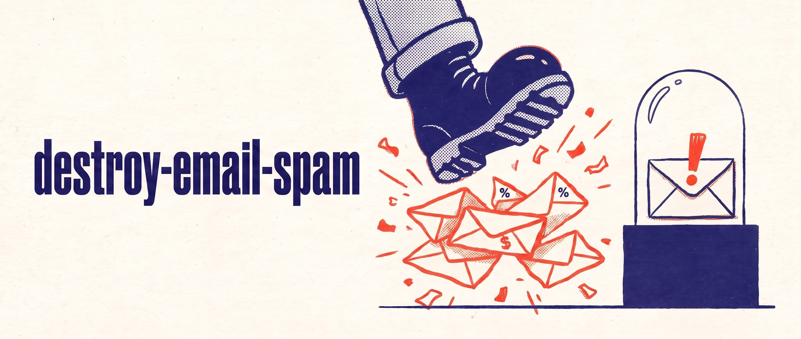

# destroy-email-spam



Google Apps Script that triages unread Gmail threads with TypeSafe's Jev API.

It labels urgent mail, leaves ordinary mail in the inbox, and labels plus archives unsolicited sales pitches. The script does not use the OpenAI Responses API.

## Quick start

1. Open [script.google.com](https://script.google.com/) and create a new standalone project.
2. Paste the contents of [`Code.gs`](Code.gs) into the editor.
3. Add `TYPESAFE_API_KEY` under **Project Settings → Script properties**.
4. Run `initializeDestroyEmailSpam()` once and approve the requested permissions.
5. Run `testJevConnection()` to confirm the Jev connection.

The initializer creates the Gmail labels and a five-minute trigger automatically.

## What it does

- `urgent`: same-day deadline, production/security/legal emergency, or critical customer/exec request.
- `maybe-important`, `not-important`, and `garbage`: available classification values. They are not applied automatically, so ordinary mail remains unchanged.
- `cold-pitch`: unsolicited sales, agency, recruiting-service, SEO, PR, sponsorship, or cold-call outreach. These threads are archived after labeling.
- `t`: triage marker. A failed Jev request is not marked, so the next trigger can retry it.

The classifier sends the latest message in each unread thread, truncated to 4,000 plain-text characters. The default run processes at most 20 threads.

## Jev cost per email

[TypeSafe publishes a rate of $0.042 per million input tokens, with free output tokens](https://typesafe.ai/blog/introducing-system-one-models-and-jev). Checked September 18, 2026. This script makes one Jev request per selected thread, using its latest message:

```text
cost per email = input_tokens × 0.042 / 1,000,000
```

Examples:

| Jev input tokens | Estimated cost per email |
| ---: | ---: |
| 500 | $0.000021 |
| 1,000 | $0.000042 |
| 1,500 | $0.000063 |
| 2,000 | $0.000084 |

The trigger logs `processed`, `archived`, `urgent`, and `estimated_jev_cost_usd`. These costs cover successful classifications with reported `usage.input_tokens`. Missing usage contributes zero to the aggregate, and failed classifications are excluded. Treat the log as a partial estimate, not a billing total. Input tokens include the policy and questions as well as the email.

Google Apps Script and Gmail quotas are separate from Jev cost. The 5-minute trigger is intentionally capped at 20 threads per run.

## Google Apps Script setup

For the detailed setup, open **Project Settings → Script properties → Add script property** and add:

```text
Property: TYPESAFE_API_KEY
Value: <your TypeSafe API key>
```

Do not put the key in the source file or commit it to Git. Each person creates their own Apps Script project and configures their own key.

In **Project Settings**, set the time zone to `America/New_York` if it is not already set. Accept the Gmail, external-request, and trigger permissions when prompted. Confirm that the `testJevConnection` execution log contains a valid label and `coldPitch` result.

`initializeDestroyEmailSpam` creates the labels and one time-driven trigger that calls `triageInbox` every five minutes. It is safe to run again; it does not create duplicate triggers.

## Safety notes

- Start with a test Gmail account or temporarily change `MAX_THREADS_PER_RUN` to `1`.
- Cold pitches are archived, but still receive the `cold-pitch` label and remain searchable.
- Urgent always wins. A message marked urgent is labeled but never archived by this script.
- The message body is sent to TypeSafe. Review your organization's data-handling requirements before enabling this on sensitive mail.
- Gmail thread search is broad by design. Adjust the query in `triageInbox` if your inbox has protected labels or categories.

## Files

- `Code.gs`: Gmail trigger, Jev request, validation, labeling, and cost logging.
- `appsscript.json`: V8 runtime and project time zone.
- `assets/destroy-email-spam-hero.jpg`: README artwork, generated with Nano Banana Pro (`gemini-3-pro-image`).

## Development

Tracked in [SKY-16619](https://linear.app/skyvern/issue/SKY-16619/publish-destroy-email-spam-jev-gmail-triage-as-an-internal-repository).

For a local JavaScript syntax check:

```sh
node --check < Code.gs
```

This checks syntax only. Run `testJevConnection` in Apps Script to check your key and the live API. Confirm labeling and archiving in a test Gmail account before relying on scheduled runs.
